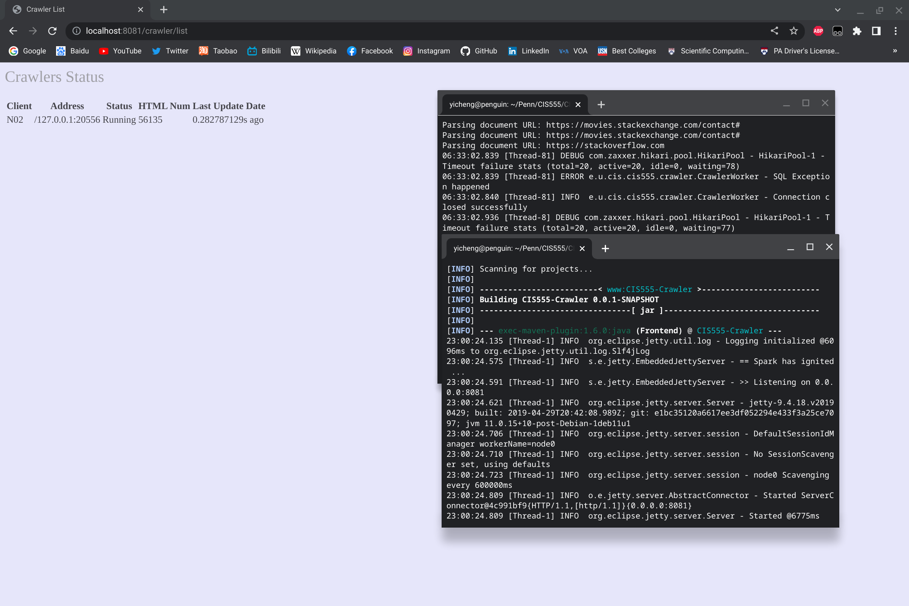

# Search Engine

## Group members
Yicheng Xia: xyicheng@seas.upenn.edu

Yihan Wang: wangyh1@seas.upenn.edu

Xiaoyu Cheng: xc3fe@seas.upenn.edu

Dali Su: dalisu@seas.upenn.edu

## Description of all features implemented
We implemented crawler, indexer, Pagerank, and web interface. We then integrated these four parts to a complete search engine.

## A list of source files included
Listed in pom.xml file.

## Detailed instructions on how to configure and run the project

### Crawler
```
cd CIS555-Crawler
mvn exec:java@Crawler -Dexec.mainClass="edu.upenn.cis.cis555.crawler.CrawlerMain" -Dexec.args="100 N01 localhost"
```
where the max number of threads (100) and the node name (N01) can be changed.

Then we can run and see the crawler list interface.
```
mvn exec:java@Frontend
```
Demo:


### Indexer
```
cd CIS555-Indexer
mvn exec:java@Indexer
```

### PageRank

Create a jar file 
```
cd CIS555-PageRank
mvn clean compile assembly:single 
```
(assuming you already have hadoop installed)
```
cd <your hadoop directory>
bin/hadoop jar <your jar directory and name> <pageRankMain>
```

### Interface

```
cd CIS555-Interface
mvn exec:java@web
```

We get the background from random scenery photos every time we open it.

Demo:


