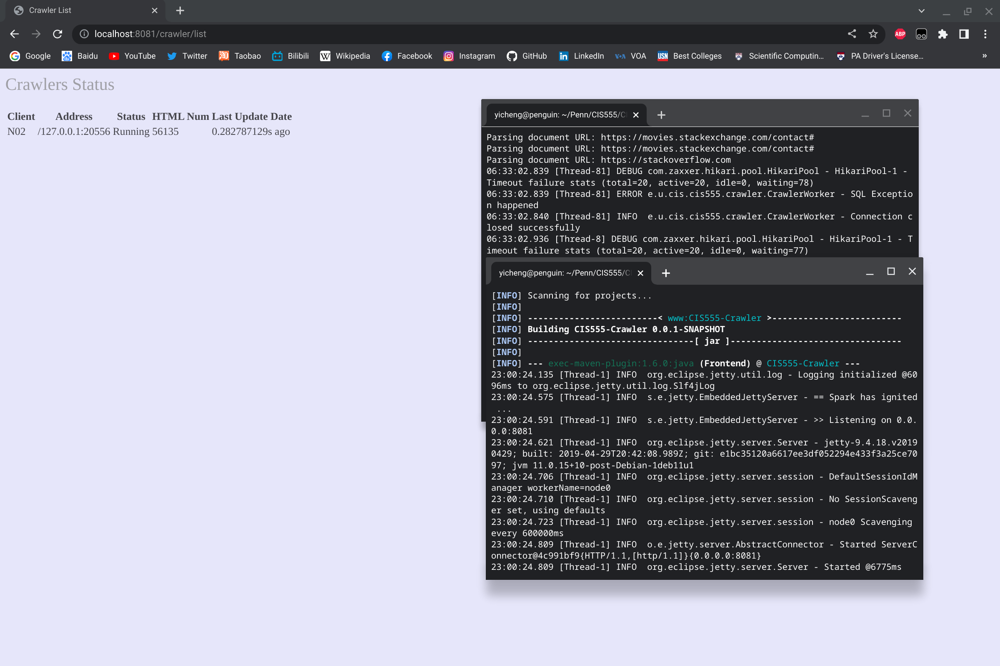
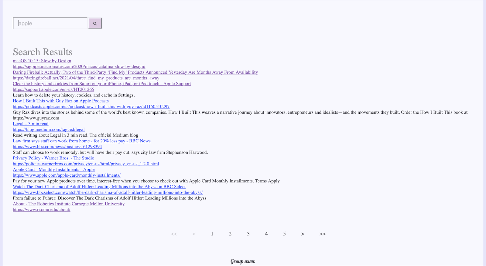

# Penn-CIS555
Here are some my CIS555 (Internet and Web Systems) coursework projects in 2022 Spring.

## Final Project: Search Engine

### 1. Group members
Yicheng Xia: xyicheng@seas.upenn.edu

Yihan Wang: wangyh1@seas.upenn.edu

Xiaoyu Cheng: xc3fe@seas.upenn.edu

Dali Su: dalisu@seas.upenn.edu

### 2. Description of all features implemented
We implemented crawler, indexer, Pagerank, and web interface. We then integrated these four parts to a complete search engine.

### 3. Extra credit
N/A

### 4. A list of source files included
Listed in pom.xml file.

### 5. Detailed instructions on how to configure and run the project

*Crawler*
```
cd CIS555-Crawler
mvn exec:java@Crawler -Dexec.mainClass="edu.upenn.cis.cis555.crawler.CrawlerMain" -Dexec.args="100 N01 localhost"
```
where the max number of threads (100) and the node name (N01) can be changed.

Then we can run and see the crawler list interface.
```
mvn exec:java@Frontend
```
Demo:


*Indexer*
```
cd CIS555-Indexer
mvn exec:java@Indexer
```

*Pagerank*

Create a jar file 
```
cd CIS555-PageRank
mvn clean compile assembly:single 
```
(assuming you already have hadoop installed)
```
cd <your hadoop directory>
bin/hadoop jar <your jar directory and name> <pageRankMain>
```

*Search engine interface*

```
cd CIS555-Interface
mvn exec:java@web
```

We get the background from random scenery photos every time we open it.

Demo:



## HW1: Web and Microservice Framework

This project is composed with 3 Milestones.

Milestone 0

• Used an existing application server framework, which helped to understand how modern web frameworks operate

• Used Spark Java (not Apache Spark), which implemented a similar model to Django (Python), Node.js (JavaScript), and many other similar platforms

Milestone 1

• Implemented a simple HTTP server for static content (i.e., files like images, style
sheets, and HTML pages)

Milestone 2

• Expanded the webserver to handle Web service calls

• Implemented a microservices framework that emulates the Spark API by attaching handlers (functions called by the Web server) to various routes (URL paths and patterns)
